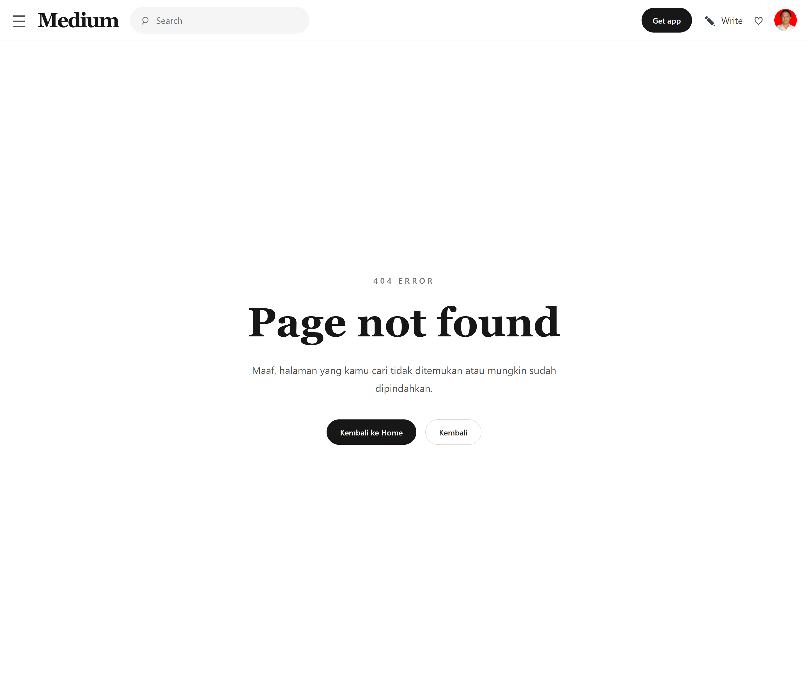

# Implementasi penggunaan Navigate dan Dynamic Path

## tampilan ini adalah replika web medium.com dan contoh penggunaan Navigate dan Dynamic Path dalam 

## Screenshot:
<table>
    <tr>
        <td>
            
        </td>
        <td>
            
        </td>
        <td>
            
        </td>
    </tr>
    <tr>
        <td>
            Screenshoot Halaman Home Page
        </td>
        <td>
            Screenshoot Detail Page
        </td>
        <td>
            Screenshoot Not Found Page
        </td>
    </tr>
</table>

Pada tampilan ini merupakan data replika web medium.com, dimana data pada article disimpan ke dalam sebuah file json, lalu ditampilkan di home, dan detail page, untuk teknik beralih ke web detail menggunakan Navigate Programmatically, serta untuk menampilkan detail page sesuai dengan isi, menggunakan Dynamic path, semua file componen dan pages sudah menggunakan dokomentasi js docs.

## Demo Aplikasi

